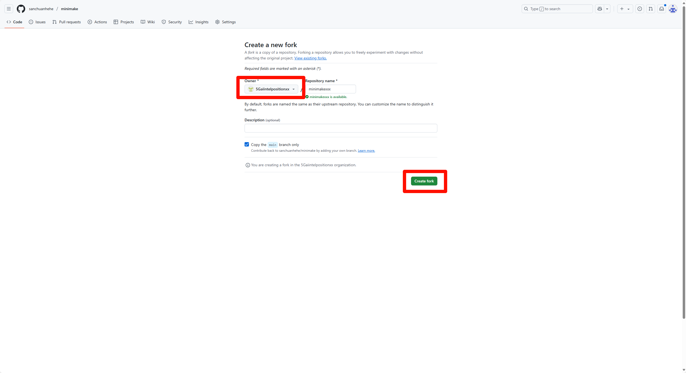
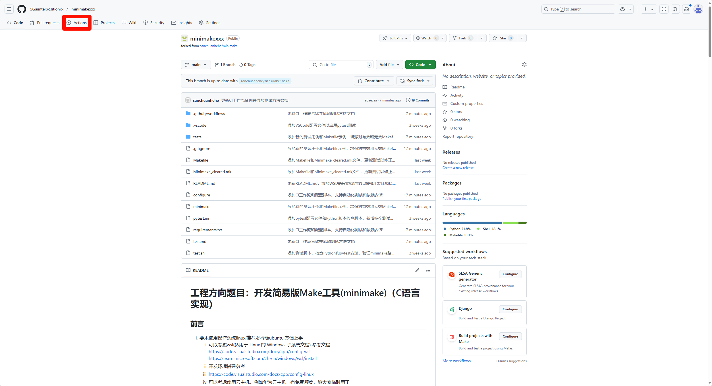
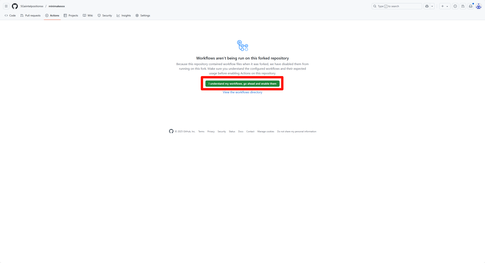
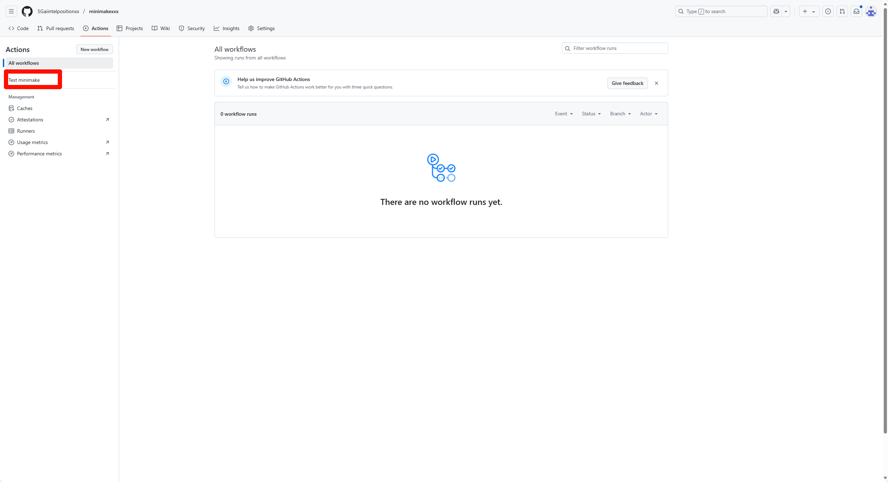
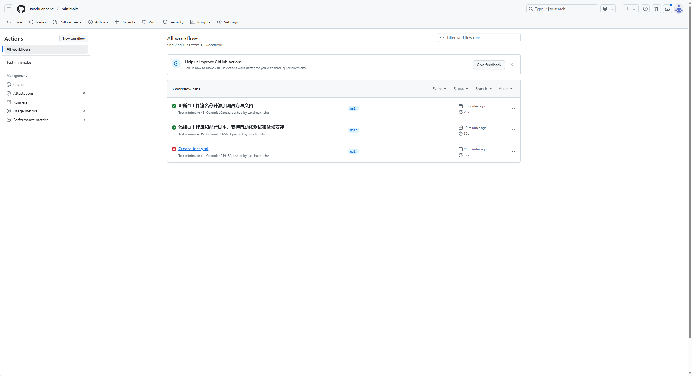
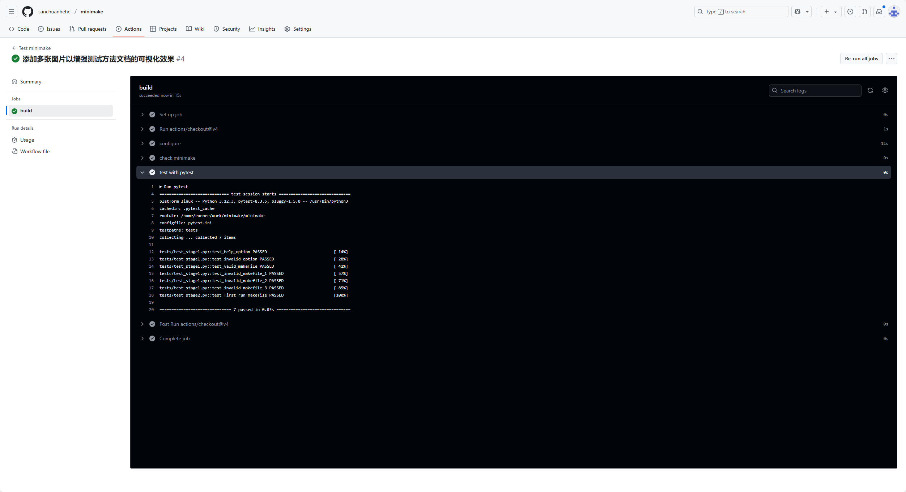

# 测试方法

## Step 1 fork本仓库

1. 点击页面右上角的 `Fork` 按钮
2. 等待仓库克隆完成

## Step 2 点击`Actions`启用工作流

1. 进入 fork 后的仓库
2. 点击顶部导航栏中的 `Actions` 选项

3. 点击绿色按钮确认启用 GitHub Actions

## Step 3 替换本仓库中的`minimake`文件

1. 替换仓库根目录下的`minimake`文件为你的实现

## Step 4 查看`Actions`执行情况

1. 返回 `Actions` 页面

2. 等待自动测试完成
3. 绿色对勾表示通过测试

4. 红色叉号表示未通过，需检查日志定位问题
